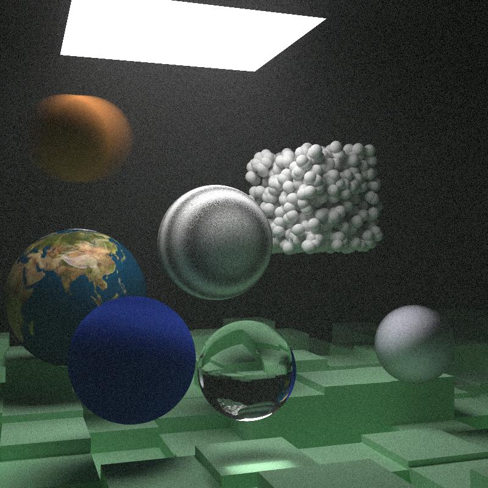

# Physically Based Monte Carlo Ray Tracer

A CPU-based physically based Monte Carlo ray tracer written in modern C++17. The renderer simulates the transport of light by recursively tracing rays through a virtual scene to generate photorealistic images using Monte Carlo path tracing techniques.

> For implementation details and design decisions, see **IMPLEMENTATION.md**.

---

# Requirements

* C++17 compatible compiler
* Linux 

---

# Building

Clone the repository:

```bash
git clone <repository-url>
cd raytracer
```

Create a build directory:

```bash
mkdir build
cd build
```


---

# Running

Execute the renderer:

```bash
./raytracer > image.ppm
```

The renderer writes the final image in **PPM** format.

---

# Converting the Output

Convert the generated image to PNG using ImageMagick:

```bash
magick image.ppm image.png
```

---

# Configuration

Rendering parameters can be modified in the source code, including:

* Image resolution
* Samples per pixel
* Maximum recursion depth
* Camera parameters
* Scene selection

---

# Gallery

## Random Sphere Scene



---

## Cornell Box


---

# Repository Structure

```text
.
├── engine/
├── images/
├── ui/
├── README.md
├── IMPLEMENTATION.md

```

---

# References 
```text

    Ray tracing in a weekend -Peter Shirley
    Ray tracing the next weekend  ~Peter Shirley
```

# License

MIT License.


